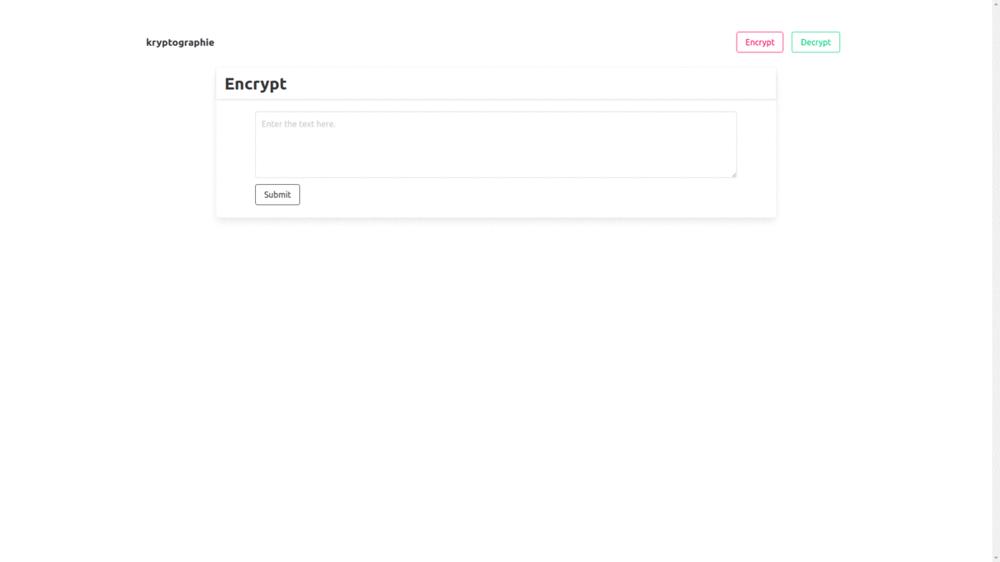

# kryptographie

A Flask app that can be used for secure encryption and decryption for given text using the Fernet utility of the cryptography module.

The user can enter any text, following which the webapp generates a key and outputs the encrypted text along with the key. The user has to use the same key for decrypting the encrypted text.

The website is deployed [here](http://kryptographie.pythonanywhere.com/).

## Preview

## Getting Started

1. Fork the repository and then clone the repository locally. Type the following command/s in the terminal. \
   `git clone https://github.com/<YOUR USERNAME>/kryptographie.git`

2. Navigate to the app directory. Type the following command/s in the terminal. \
   `cd kryptographie`

3. Create a new virtual environment and install the required Python modules. Type the following command/s in the terminal. \
   `python3 -m venv venv` \
   `source venv/bin/activate` \
   `pip install -r requirements.txt`

4. Export the Flask environment variables. Type the following command/s in the terminal. \
   `export FLASK_APP=kryptographie` \
   `export FLASK_ENV=development` \
   Note, the value of _'FLASK_ENV'_ must be set to 'production' while deploying the application.
5. Run the app. Type the following command/s in the terminal. \
   `flask run`
